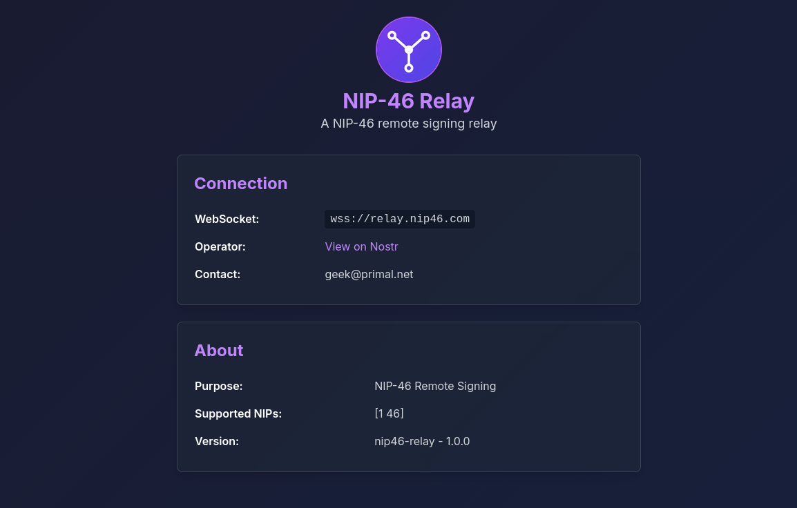

<p align="center">
  
</p>

# NIP-46 Relay on StartOS

> **Upstream repo:** <https://github.com/Letdown2491/nip46-relay>

A StartOS package for [nip46-relay](https://github.com/Letdown2491/nip46-relay),
a lightweight [NIP-46](https://github.com/nostr-protocol/nips/blob/master/46.md)
relay for Nostr remote signing. It accepts only NIP-46 traffic (kinds 24133 and
24135), buffers signing messages in memory by default (nothing touches disk),
validates event timestamps, and rate-limits per pubkey. Use it with self-hosted
signers like [nsec.app](https://nsec.app),
[Signet](https://github.com/letdown2491/signet), or any NIP-46 compatible client.

This repository wraps the upstream relay into an installable `.s9pk` for
**StartOS 0.4** using the [`@start9labs/start-sdk`](https://www.npmjs.com/package/@start9labs/start-sdk)
TypeScript SDK.

## Screenshot

<p align="center">
  
</p>

## How it's packaged

- **Image** is built from source: the [`Dockerfile`](Dockerfile) clones the
  upstream repo at the pinned `UPSTREAM_REF` tag (currently `v1.0.0`) and
  compiles a static Go binary for each target architecture
  (x86_64, aarch64, riscv64).
- **One interface** (`ui`) is exported on port `3334`. The same HTTP binding
  serves both the relay info landing page and the NIP-46 WebSocket endpoint.
- **Configuration** is exposed through the **Configure** action and persisted to
  `store.json` on the `main` data volume. `startos/main.ts` reads it and passes
  the values to the relay as environment variables, restarting the daemon when
  settings change.
- **Storage** defaults to the ephemeral in-memory backend. Switching to the
  `badger` backend persists buffered events to the `main` volume (included in
  backups).

## Build

Requires [`start-cli`](https://docs.start9.com/packaging) and Docker.

```bash
npm install        # install SDK + build tooling
npm run check      # type-check the package (tsc --noEmit)
make               # build .s9pk for the default arches (x86_64, aarch64)
make x86           # or build a single arch
```

Inspect the result:

```bash
start-cli s9pk inspect nip46-relay_x86_64.s9pk manifest
```

## Install on a StartOS server

Either sideload the generated `.s9pk` through the StartOS UI, or, with
`host: http://your-server.local` set in `~/.startos/config.yaml`:

```bash
make install
```

## Updating to a new upstream release

1. Bump `buildArgs.UPSTREAM_REF` in [`startos/manifest/index.ts`](startos/manifest/index.ts)
   to the new upstream tag.
2. Add a new entry under [`startos/versions/`](startos/versions/) and set it as
   `current` in `versions/index.ts`.
3. Rebuild and publish.

## License

MIT — see [LICENSE](LICENSE).
